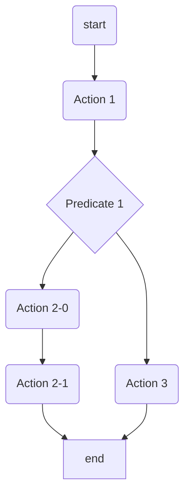
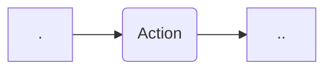
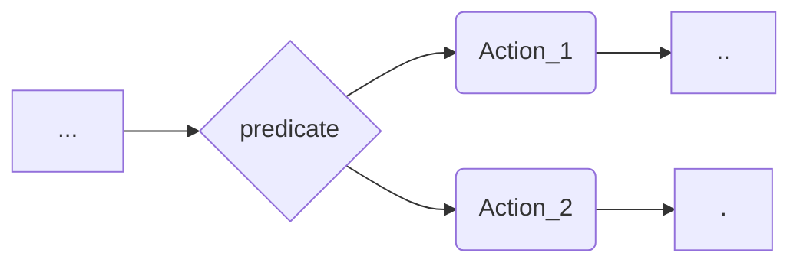
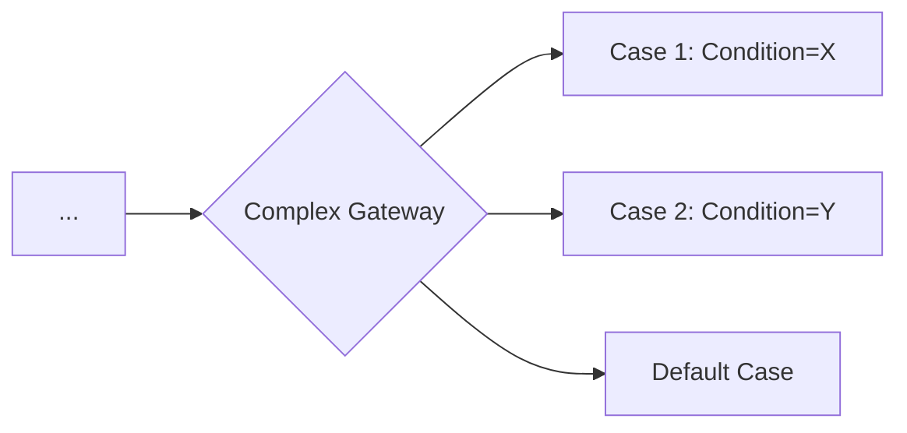

# Rules engine UI Modeler (v1.0-RC)

The UI Modeler of the Rules engine is a UI Web Designer to design business rules and visualize the associated rules excution flow.

- An important functionnality of the Designer is the ability to live watch the rules flow while designing (WYSWYG).
> Note: see the swagger editor https://editor-next.swagger.io/ for an example
- Another functionnaly, is the components palette of the designer, for the rules components, allowing to easily draw the flow using simple drap and drop and online edition features.
> Note: the Camunda modeler https://camunda.com/platform/modeler/ for an example
- The designer allows to export the rule flow in a JSON format, in order to be used in one of the code generators - Java/NodeJs.

  On can also export the workflow in an image format, for sharing and collaboration
> Note: see the Conductor UI designer https://github.com/Netflix/conductor-ui

# Components

## Rule
A rule is a set of (serviceDefinition) **actions** and **operators** that are executed following a given (directed) schema.

### example

## Action

An "*action*" is a *serviceDefinition* component, generally backed by a serviceDefinition, and is aimed to execute a single treatment.
The action component should have the following properties :

- **name**: a human friendly name (default to action_name)
- **id**: the action name, used to bind to the back serviceDefinition. It is mandatory and should be unique within the Rule definition.

## Predicate

An "*operator*" component that offers the ability to implement the "if/else" operation in the Rule flow.

# Output JSON format
The output json format, fully describes the Rule execution workflow and has the following format :

    {
	    "$id": "https://kockpit.com/rules/rules.schema.json",
	    "$schema": "https://json-schema.org/draft/2020-12/schema",
	    "title": "rule-flow"
	    "type": "object",
	    "properties": {
		    "name": {
			    "type": "string",
			    "description": "Human readable rule name"
		    },
		    "actions": {
			    "type": "array",
			    "items: {
				    "type": "array",
				    "items": { "$ref": "#/$defs/actions" }
			    }
		    },
	    }
	    "$defs": {
		    "actions": {
			    "type": "object",
			    "required": [ "action_name" ],
			    "properties": {
				    "name": {
					    "type": "string",
					    "description": "A human readable name of the action"
				    },
				    "action_name": {
					    "type": "string",
					    "description": "serviceDefinition name of the action"
				    }
			    }
		    }
	    }
    }

## Complex Gateway
A "*Complex Gateway*" component that enables multi-condition branching in the Rule flow with case-based routing and a default fallback path.

# Output JSON format
The output json format, fully describes the Rule execution workflow and has the following format :

    {
        "name": "Rule with Gateway",
        "steps": [
            {
              "type": "action",
              "id": "start",
              "name": "Initiate"
            },
            {
              "type": "ComplexGateway",
              "id": "Complex_1",
              "cases": [
                {
                "condition": "Condition_1",
                "targetId": "Action_1"
                },
                {
                "condition": "Condition_2",
                "targetId": "Action_2"
                }
              ],
              "defaultId": "default_case"
            },
            {
               "type": "action",
               "id": "Action_1",
               "name": "Action 1"
            },
            {
               "type": "action",
               "id": "Action_2",
               "name": "Action 2"
            },
            {
               "type": "action",
               "id": "default_case",
               "name": "Action 3"
            }
       ]
    }
